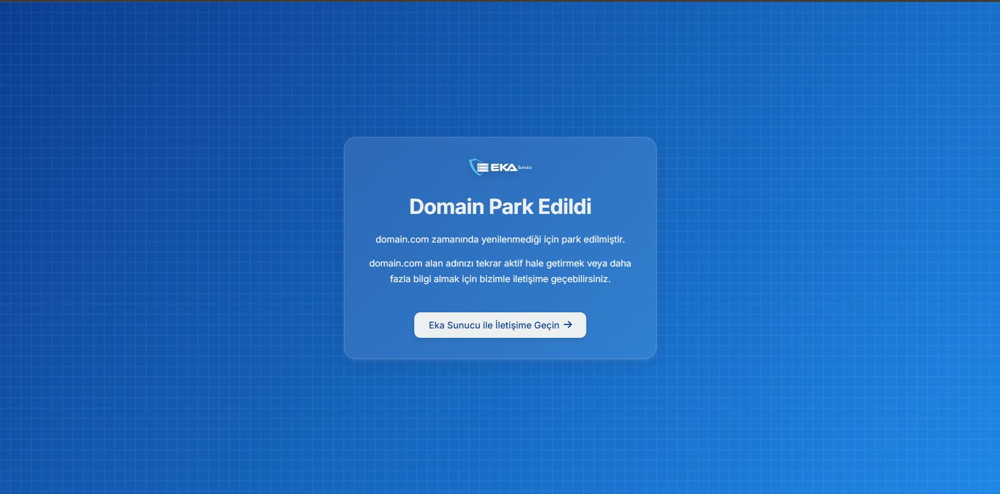

# Domain Park Sayfası

Bu proje, alan adınızın zamanında yenilenmediği durumlarda kullanılmak üzere bir **Domain Park Sayfası** oluşturmak için geliştirilmiştir. Sayfa, alan adının park edildiğini bildiren modern ve duyarlı bir tasarıma sahiptir.

## Özellikler

- **Duyarlı Tasarım:** Mobil ve masaüstü cihazlarda uyumlu görüntüleme.
- **Dinamik Mesajlar:** Alan adı bilgisi otomatik olarak görüntülenir.
- **Estetik Görsellik:** Modern tipografi, animasyonlar ve şeffaf tasarım.
- **Eka Sunucu ile Bağlantı:** Kullanıcılar, Eka Sunucu ile kolayca iletişime geçebilir.

## Ekran Görüntüsü

## Kullanım

1. Proje dosyalarını indirin veya kopyalayın.
2. `index.html` dosyasını sunucunuza yükleyin.
3. Gerekirse logo ve favicon dosyalarını özelleştirin:
    - `ekasunucu-logo.svg`
    - `favicon.png`
4. Alan adınızın park edildiğini kullanıcıya bildirmek için sayfayı kullanabilirsiniz.

## Teknik Detaylar

- **HTML5** ve **CSS3** kullanılarak oluşturulmuştur.
- **Font Awesome** ikon kütüphanesi ve **Google Fonts** desteklenmiştir.
- Basit bir JavaScript kodu ile alan adı bilgisi dinamik olarak eklenir.

## Gereksinimler

- Çalışan bir web sunucusu (Apache, Nginx vb.)
- İnternet bağlantısı (harici stil ve fontlar için).

## Katkıda Bulunma

Katkıda bulunmak isterseniz aşağıdaki adımları takip edebilirsiniz:

1. Bu projeyi forklayın.
2. Yeni bir dal oluşturun: `git checkout -b yeni-ozellik`
3. Değişikliklerinizi commit edin: `git commit -m 'Yeni özellik ekle'`
4. Dalınıza push edin: `git push origin yeni-ozellik`
5. Bir Pull Request açın.

## Lisans

Bu proje **MIT Lisansı** altında lisanslanmıştır. Daha fazla bilgi için `LICENSE` dosyasını inceleyebilirsiniz.

---

**Eka Sunucu** - Profesyonel sunucu çözümleri için [Eka Sunucu](https://www.ekasunucu.com) adresini ziyaret edin.
